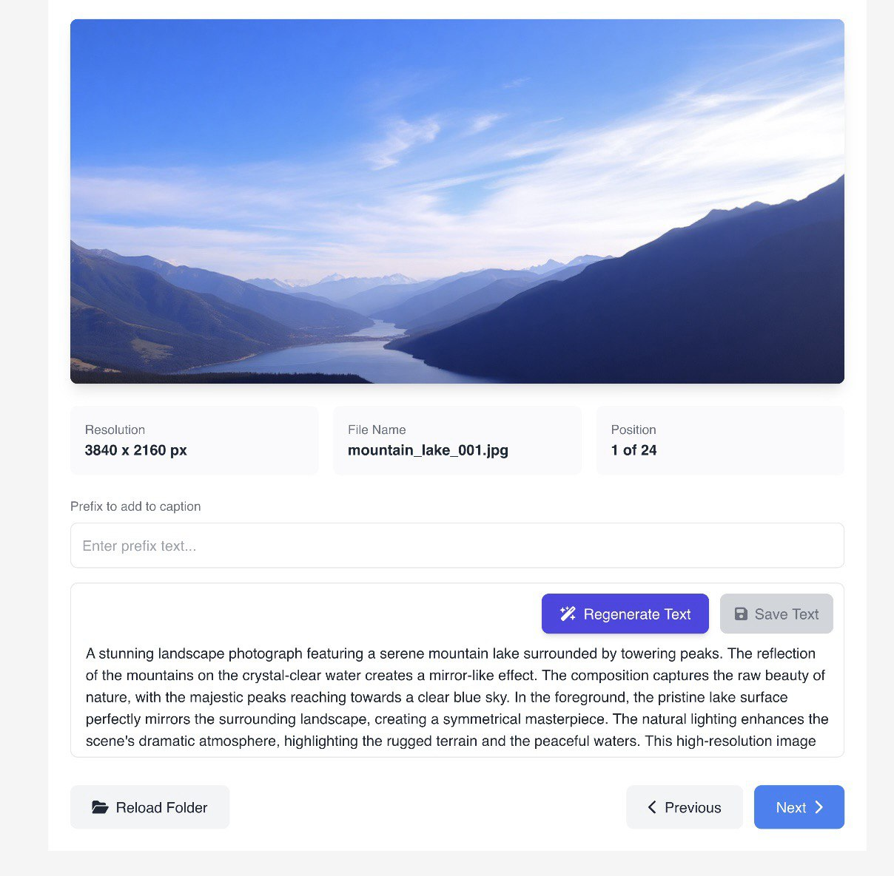
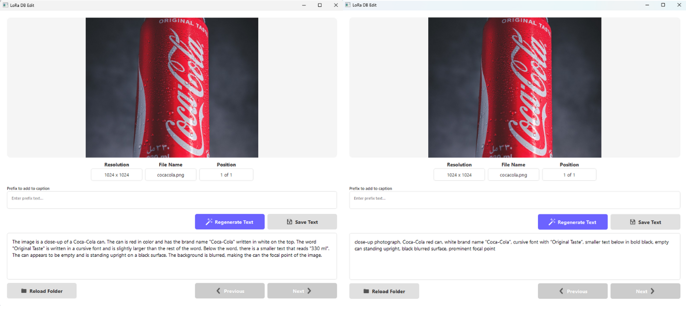
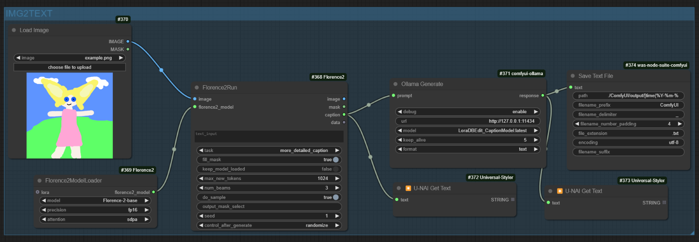

# LoraDBEdit_CaptionModel

LoraDBEdit_CaptionModel is an advanced tool designed to optimize and manage datasets for training LoRA models. It offers features for generating customized captions for images and is fully integrated with Ollama and ComfyUI for seamless automation.



## Features

- **Caption Generation**: Automatically generates captions for images using the LoraDBEdit_CaptionModel.
- **Custom Prefixes**: Add specific prefixes or keywords to captions for better organization.
- **User-Friendly Interface**: Load, view, and edit datasets with detailed information about resolution, file name, and progress.
- **Quick Regeneration**: Captions can be regenerated in approximately 13 seconds per image.

## Prerequisites

To use LoraDBEdit_CaptionModel, ensure the following are installed:

1. **Ollama**: Install Ollama to create and manage the model.
2. **Python Dependencies**:
   - `requests`
   - `PyQt5`
   - `Pillow`

Install dependencies with:
```bash
pip install requests PyQt5 pillow
```

## Installation

### 1. Create the Model
Copy the path to the `Modelfile` in your local environment and run the following command to create the model using Ollama:
```bash
ollama create LoraDBEdit_CaptionModel -f <path_to_Modelfile>
```
Replace `<path_to_Modelfile>` with the actual path where the `Modelfile` is located.

## Automating with ComfyUI

For full automation, integrate LoraDBEdit_CaptionModel with ComfyUI using Ollama nodes and Florence2run.

### Additional Prerequisites
1. **ComfyUI**: Install ComfyUI and its Ollama nodes.
2. **Florence2run**: Required for generating image descriptions before caption refinement.

### Steps for Automation
1. Use Florence2run to describe each image in your dataset.
2. LoraDBEdit_CaptionModel refines the description into a LoRA-compatible caption.
3. Integrate the tool within ComfyUI using the Ollama nodes to automate the entire process.

## Current Status

The project is currently in **optimization phase** and will be released soon. Stay tuned for updates and the final version!

## Usage

1. **Prepare the Dataset**:
   - Use the LoraDBEdit interface to load and manage your image dataset.
   - Generate captions using the installed model.
  
2. **Generate Captions**:
   - Add prefixes or modify captions as needed using the interface.
   - Save and manage the dataset for LoRA training.
  


3. **Automate with ComfyUI** (Optional):
   - Integrate with ComfyUI for seamless workflow automation.



## Contributions
Contributions are welcome! Feel free to fork the repository and submit pull requests for any improvements or new features.

## License
This project is licensed under the MIT License. See the `LICENSE` file for more details.

## Support
For questions or issues, please open an issue on GitHub or contact us directly.
